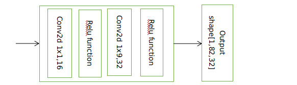
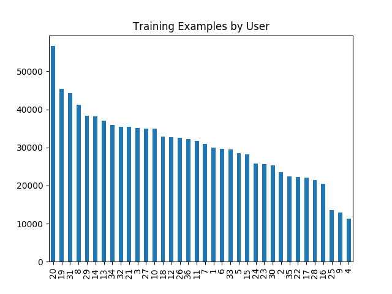
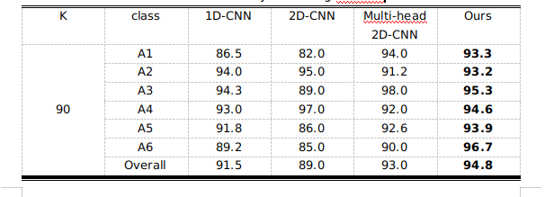
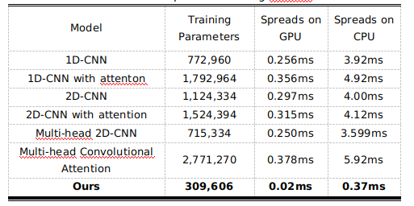

# Deep Wise Convolutional Nerual Networks for Human Activity Recognition (HAR)
Motivated by MobileNet, we design a lightweight convoluational neural networks (CNNs) for HAR, called Deep Wise Convolutional Nerual Networks (DWCNNs). 
## Methodology

Fig 1: The diagram of DWCNNs.

### DeepWise Network

Fig 2:  Details of the DeepWise network.

## Experiment
### Experimental Sertup
WISDM is a widely used HAR dataset, which its details are shown in Fig. 3.

Fig 3:  Details of WISDM.

Note that this experiment is run on Python3 & Tensorflow tools.

### Experimental Results
### Table
Table 1: Results of various CNNs-based algorithms in terms of the top-1 accuracy.

Table 2: Complexity of various algorithms.

